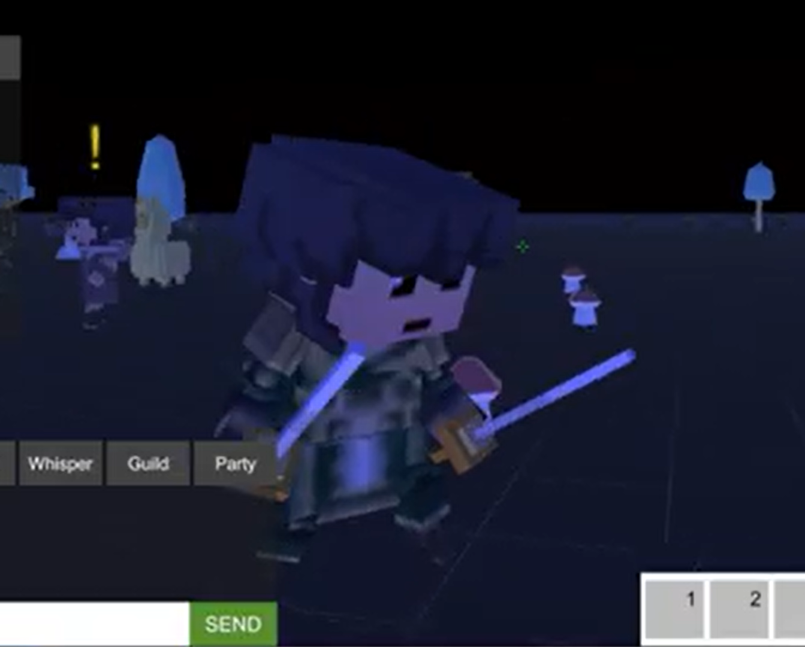
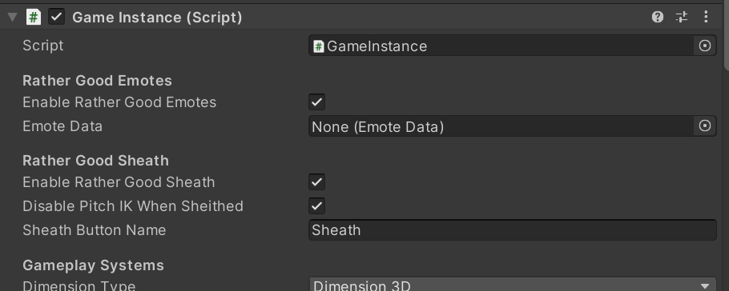
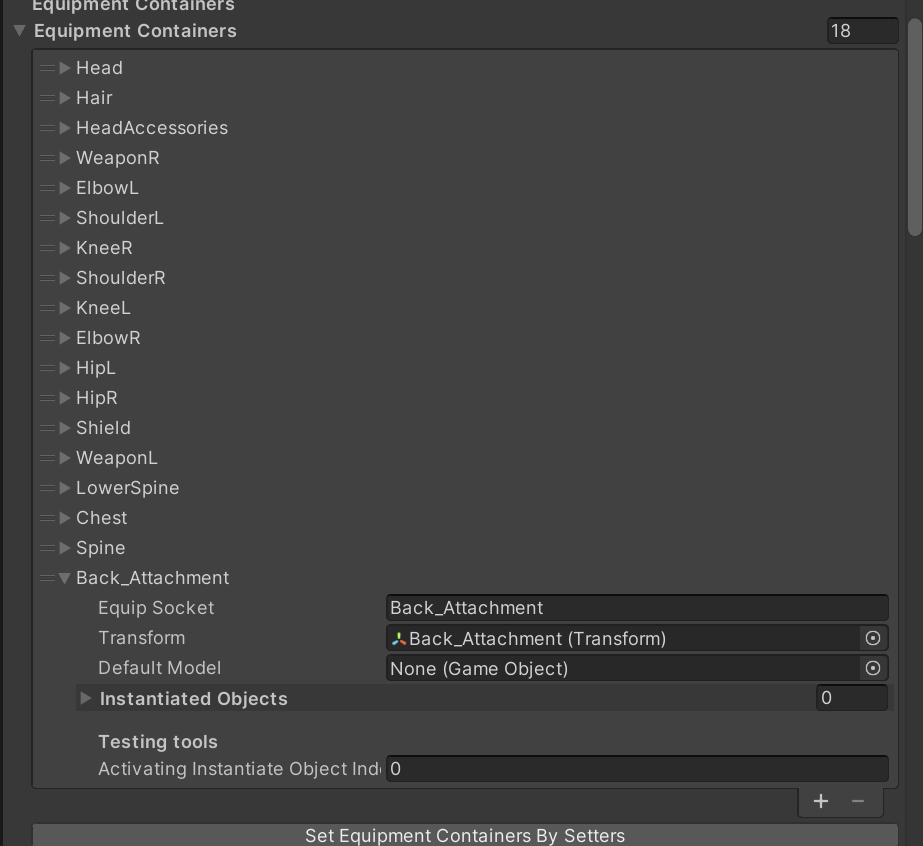
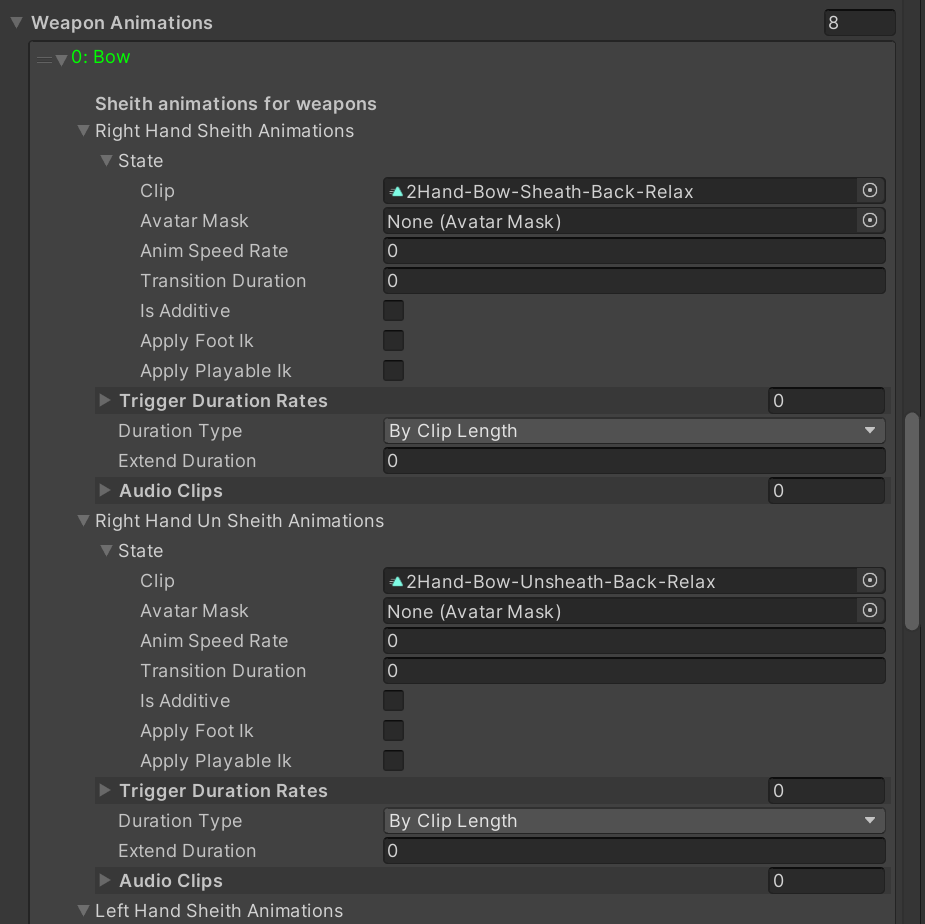
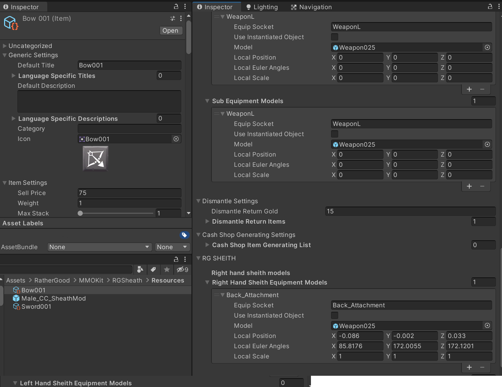

# RGSheath

**Credits:** 

Special thanks to https://github.com/benhamlett aka TidyDev and his TidyPlayerSheath addon that helped make this project possible.

And Special thanks to https://github.com/Callepo aka Callepo[AlphaAF] for updates, bug fixes and improving compatability with the MMORPG Kit.

**Author:** RatherGood1

**Version**: 0.15

This is a working functional demo. Check back often for further change/improvements.

0.15 Adds unlimited extra weapon sets and fixes a few more bugs.

0.13 Fixes sheathed weapons not showing in char select screen (Only shows single weapon set)

0.12 Fixes some issues with second weapon set not displayign properly.

**Updated:** 13 Dec 21

**Compatibility:** Tested on Suriyun MMORPG Kit Version 1.72c4 and Unity 2021.1.23f

**Description:** 

This is a modification/addon to https://github.com/suriyun-production/mmorpg-kit-docs sheath / un-sheath animations and model switching support.

Works with the ShooterPlayerController. Not tested with others. When sheathed, switches to "Adventure" mode and "Combat" mode when unsheathed. Plays the appropriate animation and switches the weapon models aat the appropriate time.

When sheathed, default animations are used and the appropriate weapon animations when un-sheathed.

Only bow and 1 Hand Sword are implemented in the example demo.

**Demo Video:**

**Other Dependencies:**

You need to provide your own animations. Example uses Explosive "RPG Character Mecanim Animation Pack" not included.  https://assetstore.unity.com/packages/3d/animations/rpg-character-mecanim-animation-pack-63772

**QUICK START:**

If you would like to test out RGSheath functionality. 

1. Start a fresh Unity 3D project.
2. From the unity asset store:     Download: MMOKIT 1.72c4+ and "RPG Character Mecanim Animation Pack"
3. Import the latest RGSheathVXXX.unityPackage
4. Add this scene to the top of your build settings then open and run the scene: Assets\RatherGood\MMOKit\RGSheath\Scenes\00InitTestRGSheath
5. Equip a Bow001 and Sword001(single/dual) in the inventory weapon switch.
6. Press "Z" to sheath/un-sheath. "~" to change weapons.
7. Press "V" to enter first person view.

NOTES:

* Look at the "Male_CC_RGSheath" Prefab and see how its set up.
* ShooterCharacterControllerRG should be the controller used on your GameInstance.
* Make sure the new weapons are in your database.
* (NOTE:) "PlayableCharacterModel_Custom" replaces PlayableCharacterModel on the player. You may need to view the prefab in "Debug" mode if all the fields do not show in the inspector.
* PitchIK settings vary by model or weapon type. PitchIKMgr_RGSheath may help tweek settings for your model. Results will vary. DEtermine y experimentation in run mode, copy and save in editor.

**Core MMORPG Kit modifications:**

Thans to Callepo there are no core modifications needed!

**Instructions for use:**

Enable on GameInstance:

Create equipment containers to hold sheathed weapons and sheathed models. i.e. scabard can be added to back or hips when sheathed.

Add animations for sheathing/unsheathing weapons right/left or dual or whatever. ***NOTE: Trigger duration will apply at 0.5 * animation time if no "trigger duration rate" is supplied. Only looks at first value supplied in array. Alternatively you can have weapons swap at specific time in animation by applying 0-1 value.***

Set the sheath models to the container and apply position/rotation offsets. 

**Done.**

